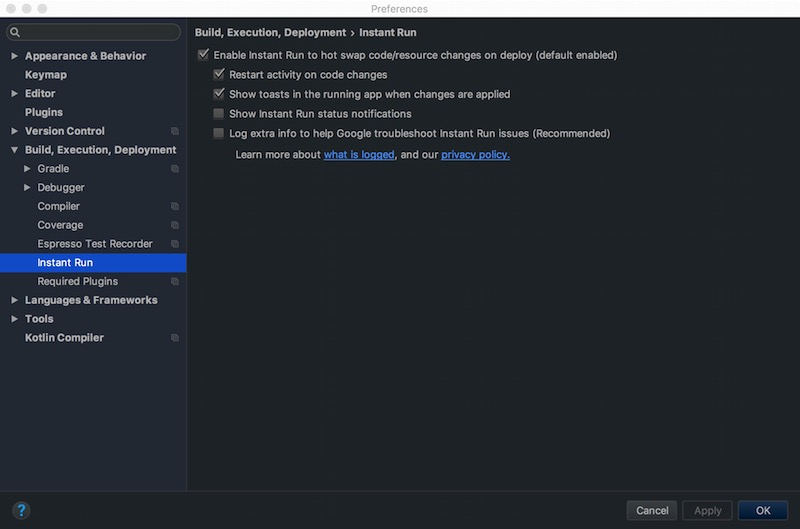
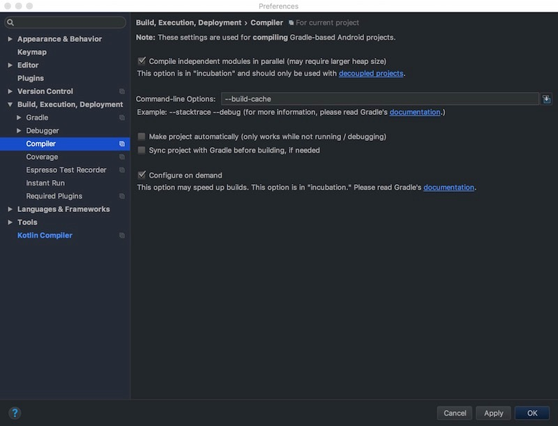

# Android

## Setup gradle

### Setup "local.properties" file, set location of android SDK

The SDK location may like:

```properties
ndk.dir=/usr/local/opt/android-sdk/ndk-bundle
sdk.dir=/usr/local/opt/android-sdk
```

### Setup "gradle.properties" file, set build options

Set JVM options for gradle

```properties
org.gradle.jvmargs=-Xmx2048m -XX:MaxPermSize=512m -XX:+HeapDumpOnOutOfMemoryError -Dfile.encoding=UTF-8
```

Enable build in multi-thread

```properties
org.gradle.parallel=true
```

Enable daemon process of gradle

```properties
org.gradle.configureondemand=true
org.gradle.daemon=true
```

## Setup android studio

### Enable instant build



### Setup compiler options

